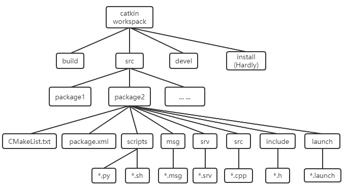

## I. Introduction to ROS Architecture

### Overview of ROS and Its Purpose in Robotics

- **ROS (Robot Operating System)**:

  - Open-source framework for robotics.
  - Not an operating system in the traditional sense; it's middleware for robotic development.
  - A platform used for academic research, industry, and hobbyist projects.

- **Purpose of ROS**:
  - Facilitates building, simulating, testing, and deploying robotic applications.
  - Supports sharing tools and capabilities across diverse robotic applications.

### Key ROS Concepts

- **Modularity**:
  - Robots are structured as smaller, manageable components called "nodes."
  - Nodes represent processes performing specific tasks.
  - Promotes independence and allows combining different nodes to create complex systems.

- **Distributed Systems**:

  - Nodes can run on different machines and communicate across a network.
  - Enables scalability and integration with a variety of hardware and software systems.

- **Message-Based Communication**:
  - ROS nodes communicate using a message-passing system.
  - Three main mechanisms: "topics," "services," and "actions."

- **Topics**:
  - Named channels for asynchronous message broadcasting.
  - Nodes can "publish" data or "subscribe" to receive data.

# But How All these things Exist in real ??!

## II. ROS File System

### Overview

- The ROS (Robot Operating System) file system refers to the way ROS organizes files and directories for developing and managing robotic applications.

- Understanding the ROS file system is crucial for navigating, creating, and managing ROS packages, workspaces, and configuration files.
- This system facilitates collaborative development, reusability, and proper organization of code and resources in ROS projects.

### Key Components of the ROS File System

- **ROS Workspaces**:

  - Directories where you build, compile, and organize ROS packages.
  - Workspaces allow you to isolate and manage different sets of packages.
  - Popular workspace types include "catkin".

- **ROS Packages**:

  - Fundamental building blocks of the ROS ecosystem.
  - Contain code, configuration files, launch scripts, and other resources.
  - Typically organized around a specific functionality or component.

- **ROS CMake and Build Files**:

  - ROS relies on CMake to define build instructions.
  - Each package contains a `CMakeLists.txt` file to specify how it should be built.
  - A package may also contain a `package.xml` file that defines package metadata, dependencies, and export information.

- **ROS Launch Files**:

  - Used to start one or more ROS nodes and set up the system's runtime environment.
  - Launch files are usually in XML format and reside within ROS packages.
  - Provide a convenient way to define how ROS components should be started and configured.

# [Hands-On 1: Creating a New ROS Workspace and Package](./Hands-On-1:Creating-a-New-ROS-Workspace-and-Package.md)

# [Hands-On 2: Launching Turtlebot 3 Simulation in Gazebo with ROS Noetic](./Hands-On-2:Launching-Turtlebot-3-Simulation-in-Gazebo.md)
