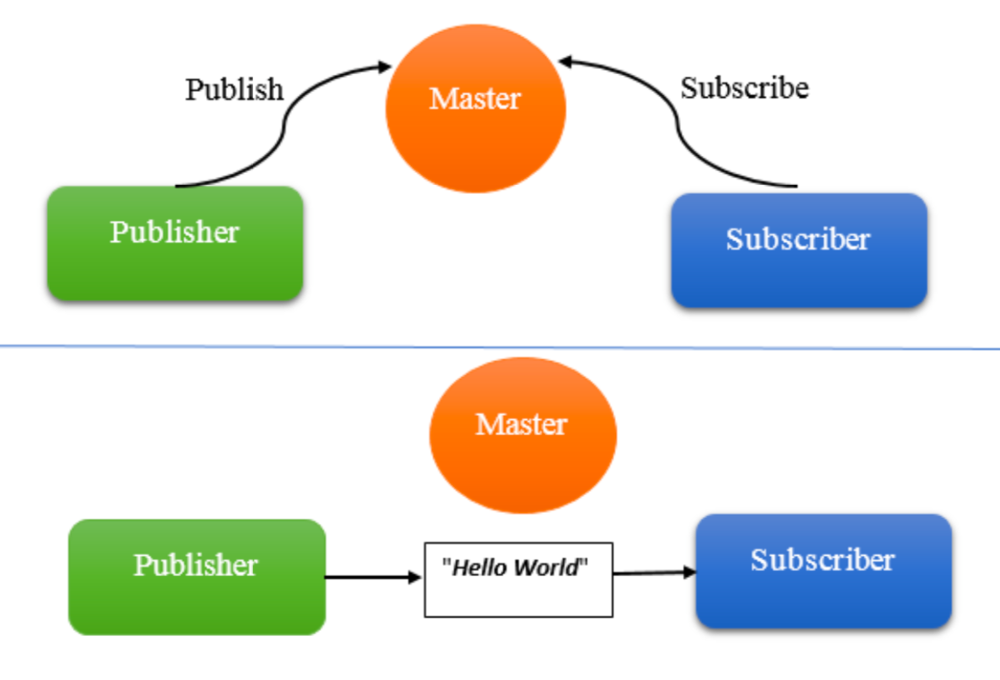

# I. ROS Publisher Using Python

A ROS Publisher allows a ROS node to send messages to a specific topic. In a ROS system, topics are named communication channels where data is sent and received asynchronously. This documentation will guide you through the process of creating a simple ROS Publisher using Python, with the `rospy` library.

## Prerequisites

- ROS 1 installed on your system (e.g., ROS Noetic).
- A ROS workspace set up with a source directory for ROS packages.
- Basic knowledge of Python and ROS concepts such as nodes, topics, and messages.

## Step 1: Create a ROS Package

Before creating the publisher, let's ensure you have a ROS package to work within.

1. **Navigate to Your Workspace Source Directory**:

   ```bash
   cd ~/catkin_ws/src
   ```

2. **Create a New Package**:

   ```bash
   catkin_create_pkg my_publisher std_msgs rospy roscpp
   ```

   This command creates a new package named `my_publisher` with dependencies on `std_msgs`, `rospy`, and `roscpp`.

3. **Build the Workspace**:

   ```bash
   cd ~/catkin_ws
   catkin_make
   ```

   This compiles your workspace and registers the new package with ROS.

## Step 2: Create a ROS Publisher Node in Python

Once the package is set up, you can create a Python script to act as your ROS Publisher.

1. **Create the Python Script**:
   Navigate to the `src` directory of your package and create a new Python script.

   ```bash
   cd ~/catkin_ws/src/my_publisher
   touch simple_publisher.py
   chmod +x simple_publisher.py  # Make the script executable
   ```

2. **Write the Publisher Code**:




   Open `simple_publisher.py` in a text editor and add the following code:

   ```python
   #!/usr/bin/env python3
   import rospy
   from std_msgs.msg import String

   def simple_publisher():
       # Initialize the ROS node
       rospy.init_node('simple_publisher', anonymous=True)

       # Create a publisher to the 'chatter' topic with message type String
       pub = rospy.Publisher('chatter', String, queue_size=10)

       # Set the publishing rate (1 Hz)
       rate = rospy.Rate(1)  # 1 Hz

       while not rospy.is_shutdown():
           # Create a message to publish
           message = "Hello ROS! Time: %s" % rospy.get_time()

           # Log the message to console
           rospy.loginfo(message)

           # Publish the message
           pub.publish(message)

           # Sleep to maintain the loop rate
           rate.sleep()

   if __name__ == '__main__':
       try:
           simple_publisher()
       except rospy.ROSInterruptException:
           pass
   ```

This script creates a ROS node called `simple_publisher` that publishes a message of type `String` to the `chatter` topic every second. It uses a `while not rospy.is_shutdown()` loop to continuously send messages until ROS is shut down or interrupted.

## Step 3: Run the Publisher Node

To test the publisher, you need to start the ROS core and then run your publisher node.

1. **Start the ROS Core**:

   ```bash
   roscore
   ```

   This command starts the ROS master, allowing nodes to communicate with each other.

2. **Run the Publisher Node**:
   Open a new terminal, source your workspace setup script, and run the Python script.

   ```bash
   cd ~/catkin_ws
   source devel/setup.bash
   rosrun my_publisher simple_publisher.py
   ```

   You should see log messages indicating that the publisher is sending messages to the `chatter` topic.

3. **Verify the Messages**:
   Open another terminal and use `rostopic echo` to listen to the `chatter` topic.

   ```bash
   rostopic echo /chatter
   ```

   You should see the messages being published by your node, confirming that your ROS Publisher is working.

