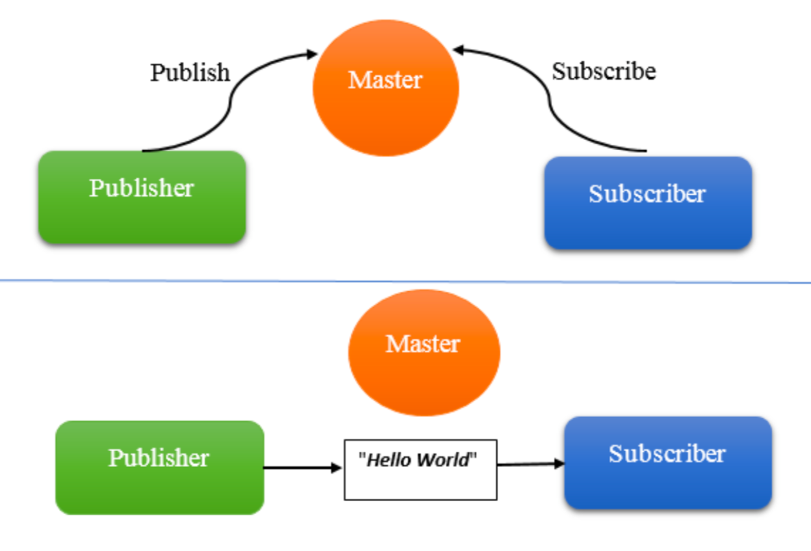

# I .ROS Subscriber Using Python

A ROS Subscriber allows a ROS node to receive messages from a specific topic. In a ROS system, topics are named communication channels through which data is sent and received asynchronously. This documentation provides a step-by-step guide to creating a ROS Subscriber using Python with the `rospy` library.

## Prerequisites

- ROS 1 installed on your system (e.g., ROS Noetic).
- A ROS workspace set up with a source directory for ROS packages.
- Basic knowledge of Python and ROS concepts like nodes, topics, and messages.

## Step 1: Create a ROS Package

If you don't already have a package for your subscriber, create one.

1. **Navigate to Your Workspace Source Directory**:

   ```bash
   cd ~/catkin_ws/src
   ```

2. **Create a New Package**:

   ```bash
   catkin_create_pkg my_subscriber std_msgs rospy roscpp
   ```

   This command creates a new package named `my_subscriber` with dependencies on `std_msgs`, `rospy`, and `roscpp`.

3. **Build the Workspace**:

   ```bash
   cd ~/catkin_ws
   catkin_make
   ```

   This compiles your workspace and registers the new package with ROS.

## Step 2: Create a ROS Subscriber Node in Python

Next, create a Python script that will act as your ROS Subscriber.

1. **Create the Python Script**:
   Navigate to the `src` directory of your package and create a new Python script.

   ```bash
   cd ~/catkin_ws/src/my_subscriber
   touch simple_subscriber.py
   chmod +x simple_subscriber.py  # Make the script executable
   ```

2. **Write the Subscriber Code**:
  
   Open `simple_subscriber.py` in a text editor and add the following code:

   ```python
   #!/usr/bin/env python3
   import rospy
   from std_msgs.msg import String

   def callback(data):
       # This function is called every time a new message is received
       rospy.loginfo("Received: %s", data.data)

   def simple_subscriber():
       # Initialize the ROS node
       rospy.init_node('simple_subscriber', anonymous=True)

       # Create a subscriber to the 'chatter' topic with message type String
       rospy.Subscriber('chatter', String, callback)

       # Keep the node alive until ROS is shut down
       rospy.spin()

   if __name__ == '__main__':
       simple_subscriber()
   ```

This script creates a ROS node named `simple_subscriber` that subscribes to the `chatter` topic, listening for messages of type `String`. The `callback` function is called whenever a new message is received. The node remains active until ROS is shut down or interrupted, thanks to `rospy.spin()`.

## Step 3: Run the Subscriber Node

To test the subscriber, ensure that a ROS core is running and a publisher is sending messages to the topic.

1. **Start the ROS Core**:
   If it's not already running, start the ROS master.

   ```bash
   roscore
   ```

   This command starts the ROS master, which is required for nodes to communicate.

2. **Run the Subscriber Node**:
   Open a new terminal, source your workspace setup script, and run the Python script.

   ```bash
   cd ~/catkin_ws
   source devel/setup.bash
   rosrun my_subscriber simple_subscriber.py
   ```

   You should see log messages indicating that the subscriber is receiving messages from the `chatter` topic.

## Step 4: Test the Subscriber

If you have a publisher sending messages to the `chatter` topic (like the simple publisher we discussed earlier), you should see the messages appearing in your subscriber's output. If not, you can publish test messages manually to ensure your subscriber works.

1. **Manually Publish a Message**:
   Open a new terminal and use `rostopic pub` to send a test message to the `chatter` topic.

   ```bash
   rostopic pub -1 /chatter std_msgs/String "data: 'Hello from ROS Subscriber!'"
   ```

   This command sends a single message to the `chatter` topic. If your subscriber is running, it should receive and log the message.


# [Hands-On: ROS Subscriber for `LaserScan` Topic](./Hands-On:ROS-Subscriber-for-LaserScan-Topic.md)