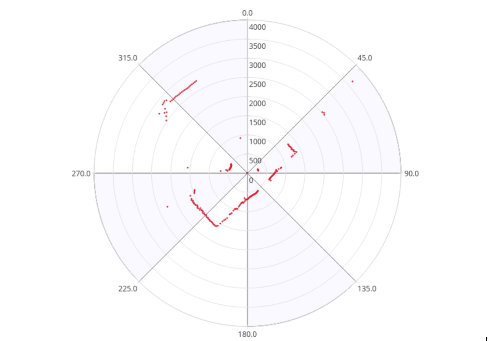

To complete this project, you need to create a ROS package, a ROS node, and a launch file that follow the provided logic for obstacle avoidance based on laser scan data. The following steps outline the process:

### Step 1: Create a ROS Package

Start by creating a ROS package named `topics_project`. This will be the package where you place your code and other resources.

```bash
# Create a new ROS package with rospy (Python) and the necessary dependencies
cd ~/catkin_ws/src
catkin_create_pkg topics_project rospy std_msgs geometry_msgs sensor_msgs
cd ~/catkin_ws
catkin_make
source devel/setup.bash
```

### Step 2: Create the ROS Node

Create a ROS Python script named `topics_project_node.py` in the `scripts` directory of your `topics_project` package.

```bash
cd ~/catkin_ws/src/topics_project/scripts
touch topics_project_node.py
chmod +x topics_project_node.py  # Make the script executable
```

### Step 3: Write the ROS Node Code

The ROS node should:

- Implement the obstacle avoidance logic as described in the task.

- Create a Publisher that writes into the /cmd_vel topic in order to move the robot.
- Create a Subscriber that reads from the /scan topic. This is the topic where the laser publishes its data.

- Depending on the readings you receive from the laser's topic, you'll have to change the data you're sending to the /cmd_vel topic in order to avoid the wall. This means, using the values of the laser to decide.
- Your program should follow the following logic:

  - If the laser reading in front of the robot is higher than 1 meter (there is no obstacle closer than 1 meter in front of the robot), the robot will move forward.

  - If the laser reading in front of the robot is lower than 1 meter (there is an obstacle closer than 1 meter in front of the robot), the robot will turn left.

  - If the laser reading at the right side of the robot is lower than 1 meter (there is an obstacle closer than 1 meter at the right side of the robot), the robot will turn left.

  - If the laser reading at the left side of the robot is lower than 1 meter (there is an obstacle closer than 1 meter at the left side of the robot), the robot will turn right.

- The logic explained above has to result in a behavior like the following:

- The robot starts moving forward until it detects an obstacle in front of it which is closer than 1 meter. Then it begins to turn left in order to avoid it.

- The robot keeps turning left and moving forward until it detects that it has an obstacle at the right side which is closer than 1 meter. Then it turns left in order to avoid it.

- Finally, the robot will continue moving forward since it won't detect any obstacle (closer than 1 meter) neither in front of it nor in its sides.

- HINT 1: The data that is published into the /scan topic has a large structure. For this project, you just have to pay attention to the 'ranges' array.

- rosmsg show sensor_msgs/LaserScan

- HINT 2: The 'ranges' array has a lot of values. The ones that are in the middle of the array represent the distances that the laser is detecting right in front of him. This means that the values in the middle of the array will be the ones that detect the wall. So in order to avoid the wall, you just have to read these values.

- HINT 3: The scope of the laser is about 180 degrees from right to left. This means that the values at the beginning and at the end of the 'ranges' array will be the ones related to the readings on the sides of the laser (left and right), while the values in the middle of the array will be the ones related to the front of the laser. Have a look at the image below in order to better understand this.



Here's a Python script that implements this behavior:

```python

```

### Step 4: Create a Launch File

Create a launch file named `topics_project.launch` to start the ROS node.

```bash
cd ~/catkin_ws/src/topics_project/launch
touch topics_project.launch
```

Here's the content of the launch file:

```xml
<launch>
    <node name="topics_project_node" pkg="topics_project" type="topics_project_node.py" output="screen"/>
</launch>
```

### Step 5: Test the Project

Ensure that your ROS workspace is built and the environment is sourced:

```bash
cd ~/catkin_ws
catkin_make
source devel/setup.bash
```

Now launch the project to test the obstacle avoidance behavior:

```bash
roslaunch topics_project topics_project.launch
```
